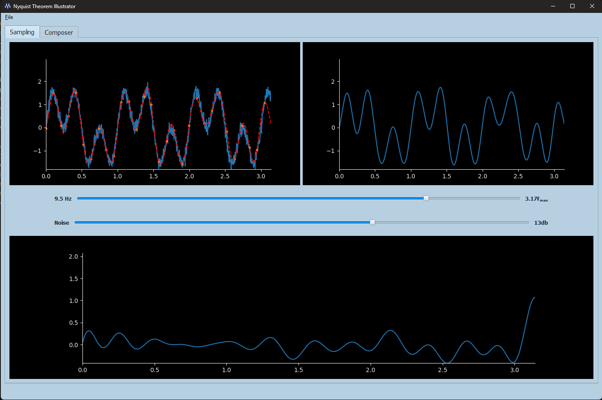
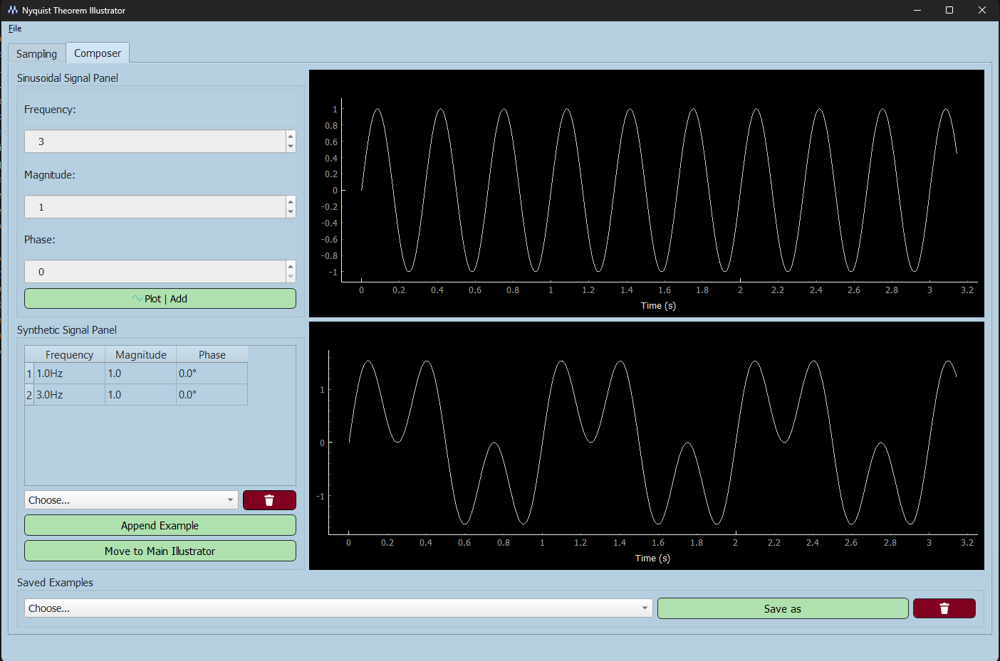

<h1>Sampling-Theory Studio</h1>

  
Sampling an analog signal is a crucial step in any digital signal processing system. The Nyquist–Shannon sampling theorem plays a vital role in ensuring the accurate recovery of a signal when sampled with a frequency equal to or greater than the signal's bandwidth. This desktop application is designed to illustrate signal sampling and recovery, emphasizing the importance and validation of the Nyquist rate.

  <h2>Features</h2>

  <h3>Sample & Recover</h3>
  <ul>
    <li>Load a mid-length signal (around 1000 points) and visualize it.</li>
    <li>Sample the signal at different frequencies.</li>
    <li>Use the Whittaker–Shannon interpolation formula for signal recovery.</li>
    <li>Display three graphs: original signal with sampled points, reconstructed signal, and the difference between the original and reconstructed signals.</li>
    <li>Show sampling frequency in either actual frequency or normalized frequency.</li>
  </ul>

  <h3>Load & Compose</h3>
  <ul>
    <li>Load a signal from a file or use a signal mixer/composer.</li>
    <li>Compose signals by adding multiple sinusoidal components with different frequencies and magnitudes.</li>
    <li>Remove any components during the composition of the mixed signal.</li>
  </ul>

  <h3>Additive Noise</h3>
  <ul>
    <li>Add noise to the loaded signal with customizable Signal-to-Noise Ratio (SNR) levels.</li>
    <li>Show the dependency of the noise effect on the signal frequency.</li>
  </ul>

  <h3>Real-time</h3>
  <ul>
    <li>Sampling and recovery occur in real-time upon user changes.</li>
    <li>No need for a manual "Update" or "Refresh" button.</li>
  </ul>

  <h3>Resize</h3>
  <ul>
    <li>The application is easily resizable without compromising the user interface.</li>
  </ul>

  <h2>Screenshots</h2>

  
  

  <h2>Getting Started</h2>

  <ol>
    <li>Clone the repository.</li>
    <pre><code>git clone https://github.com/AssemSadek90/Sampling-Theory-Studio.git</code></pre>
    <li>Install dependencies.</li>
    <pre><code>
        pip install pyqt5
        pip install numpy
        pip install pandas
        pip install Matplotlib
        pip install pyqtgraph
    </code></pre>
    <li>Run the application.</li>
    <pre><code>python sampling_theory_studio.py</code></pre>
  </ol>

  <h2>How to Use</h2>

  <ol>
    <li>Open the application.</li>
    <li>Load a signal or compose one using the mixer.</li>
    <li>Adjust sampling frequencies and observe real-time changes.</li>
    <li>Explore noise effects and signal recovery.</li>
    <li>Resize the application window as needed.</li>
  </ol>

  
Feel free to contribute, report issues, or suggest improvements!

  <h2>Contributors</h2>
  <ul>
    <li><a href="https://github.com/AssemSadek90">Assem Sadek</a></li>
  </ul>
  
Reference

  <h2>License</h2>
  
This project is licensed under the <a href="LICENSE">MIT License</a>.

